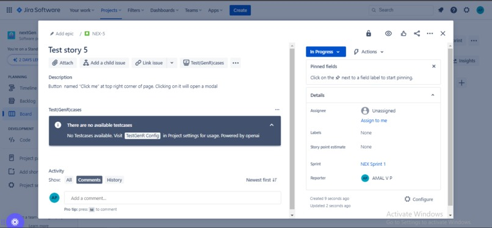
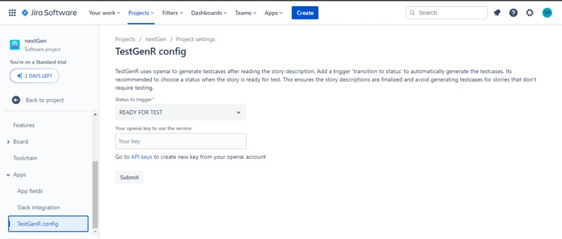

# Forge TestGenR ai

This project contains a Forge app written in Javascript that create testcases when an issue is updated in Jira.

To install in your site [Installation link](https://developer.atlassian.com/console/install/5218dcc8-b35d-40ab-8224-655c4de8b904?signature=3bbb307fccc5e0de0661248cdf8526b6848b532d4f4a89d4413338736236af634ebd175dbcffc2b040bbae9257effb34e100e526566ee41abddc821407aa8298&product=jira)

See the [demo](https://youtu.be/QUb6g86jdoo) on how to use the app.

#### No test cases



#### With generated test cases


#### Config page



## Inspiration

Test cases are an essential component of software development, ensuring that software meets quality standards, is free of bugs, and functions as intended.

**Problem Statement**

Even though automated testing is in place, manual testing is crucial since at the end of the day, most softwares are used by humans. But the documentation of testcases is a heavy task for developers/QA which consumes time that could be spent on tasks that require actual human involvement.
Moreover, in many projects testers depend on spreadsheets to manually write testcases and upload it to third party suits (like Zephyr) even if it has integration with Jira.
Testcases are written outside Jira and then later integrated with Issues

With the rise of AI and machine learning, developers can now harness the power of these technologies to streamline their testing processes and create high-quality software.

## What it does

TestGenR is an openai powered Jira app that generates testcases based on story description.

1. Add a trigger status (like Ready for Test) upon whose transition will automatically read the story descriptions and adds a list of testcases under the story.
2. The testcases are generated only if the issue type is a 'story' and will not regenerate testcases if it already exist.
3. The testcases can be fine-tuned by adding more to the statement, can be marked as verified, deleted or even add a new testcase.
4. The testcases can be directly downloaded as a csv file for further modifications or integrations with other suits.

## How we built it

1. The TestGenR config panel is built using **Forge UI kit**
2. TestGenR testcases is added as an **issuePanel** and is developed using **Custom UI** following **Atlaskit design system**, **resolver** that uses **Properties API**.
3. The backend is developed in nodejs using **Forge API** and the generation of testcases is done using **OpenAi gpt3.5-turbo** model.

## Challenges we ran into

1. We started using IssueGlance with UI kit but on oct 3rd, it was deemed deprecated, hence we switched to IssueContext.
2. UI kit was not flexible with styling hence we switched to Custom UI.
3. The editing of testcases was initially done inside a modal in UI kit, but with custom UI,, the modal is no longer appearing in center of the page,(fits within the iframe), later we moved to IssuePanel and inline edit
4. After moving to custom UI, we explored Atlaskit and inline edit components. We needed to add the checkbox label as the trigger of switching to inline edit which was not possible by default. We added the checkbox label as a React.node and added click handler to toggle the edit view while not triggering the checkbox selection.
5. The responses from GPT model were conversation based, while we required json array only. This was overcame by using schema functions.
6. Openai key limit was exhausted during development, hence we created another free trial account with different credentials.

## Accomplishments that we're proud of

1. Was able to identify a problem statement after our experiences with agile development.
2. Learned to use various forge apis, ui kit, custom ui, openai.
3. Was able to migrate to IssueContext and finally to IssuePanel after seeing that IssueGlance was deprecated. Was able to migrate to Custom UI from easy to use UI kit. Overcame its limitations.
4. Was able to integrate the checkbox label and inline edit of Atlaskit components

## What we learned

1. Forge platform, manifest rules.
2. Forge APIs, fetch, route, Properties API and Storage API - its usage, comparison and limitations.
3. UI kit, UI kit2, Custom UI, forge bridge
4. Atlassian design system, Jira modules, Project settings
5. Chat completion using schema in gpt.
6. Excel export in react.

## What's next for TestGenR AI

1. Currently the app is only trained to read the paragraphs in story description. With further improvements, it can be made to read, lists, tables, images, code.
2. Automatically send the exported excel to the integrated platforms like Zephyr.
3. Code for testcases can also be generated with this app (currently the app is capable of doing it, but we haven't enabled so as to reduce the openai token billing). This will give an outline to write unit testcases for the developers.

# Clone and Make your changes

See [developer.atlassian.com/platform/forge/](https://developer.atlassian.com/platform/forge) for documentation and tutorials explaining Forge.

## Requirements

See [Set up Forge](https://developer.atlassian.com/platform/forge/set-up-forge/) for instructions to get set up.

## Quick start

- Modify your app by editing the `src/index.jsx` file.

- Build and deploy your app by running:

```
forge deploy
```

- Install your app in an Atlassian site by running:

```
forge install
```

- Develop your app by running `forge tunnel` to proxy invocations locally:

```
forge tunnel
```

### Notes

- Use the `forge deploy` command when you want to persist code changes.
- Use the `forge install` command when you want to install the app on a new site.
- Once the app is installed on a site, the site picks up the new app changes you deploy without needing to rerun the install command.

## Support

See [Get help](https://developer.atlassian.com/platform/forge/get-help/) for how to get help and provide feedback.
